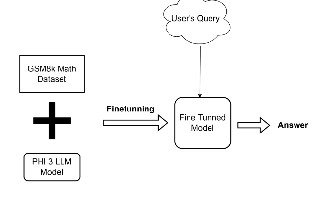

# AI Tutor For Students

## Introduction
Welcome to the project **AI TUTOR FOR STUDENTS** !

### Goals
To develop a platform where students can ask questions and system clears their confusions with clear answers like a tutor, and hence, AI Tutor. Main goals of this project are as follows:
1. Mathematical Problem Solving
2. Code Debugging Assistance
3. Answering AI related questions.

## Project Architecture
### System Block Diagram

### RAG Architecture

### MoA Architecture

### Math Q&A Architecture

### Finetuning Settings

# Status
## Known Issue
1. System fails to extract JSON response from LLM whenever escape symbol is present in the response. 
2. Sometimes, complex mathematical equations are not rendered properly.

## High Level Next Steps
1. Can integrate with vision models to help students to visualize difficult math concepts.
2. Optimization of system (mainly RAG component).

# Usage
## Installation
<!-- To begin this project, use the included `Makefile` -->

#### Creating Virtual Environment
This package is built using `python-3.11`. 
We recommend creating a virtual environment and using a matching version to ensure compatibility.
Example:
- `python -m venv .ai-tutor` with python 3.11, or
- `conda create -n .ai-tutor python=3.11` with anaconda.

Now, activate this virtual environment. Eg: `conda activate .ai-tutor` with anaconda or respectively for venv. Then you can install requirements with `pip install -r requirements.txt`.

<!-- #### pre-commit

`pre-commit` will automatically format and lint your code. You can install using this by using
`make use-pre-commit`. It will take effect on your next `git commit` -->

<!-- #### pip-tools

The method of managing dependencies in this package is using `pip-tools`. To begin, run `make use-pip-tools` to install. 

Then when adding a new package requirement, update the `requirements.in` file with 
the package name. You can include a specific version if desired but it is not necessary. 

To install and use the new dependency you can run `make deps-install` or equivalently `make`

If you have other packages installed in the environment that are no longer needed, you can you `make deps-sync` to ensure that your current development environment matches the `requirements` files.  -->

## Usage Instructions
1. Run ollama model locally. In new terminal: 
- `ollama pull anishstha245/phi3_gsm8k:latest`
- `ollama serve` (if necessary)
2. Activate previously created virtual environment. Eg: `conda activate .ai-tutor` with anaconda.
3. Create a .env file and insert API key as shown in .env.sample.
4. Navigate to directory src/ai_tutor_for_students.
5. Run the streamlit app with `streamlit run main.py` in terminal.

## Usage Instructions with Docker
1. Pull Docker images:
- For UI: `docker pull anishest2020/ai_tutor_ui:main`
- For finetuned model: `docker pull anishest2020/ollama_phi3_gsm8k:v1.0`
2. `docker-compose up` from root project directory.

# Data Source
1. https://huggingface.co/datasets/openai/gsm8k
2. [Fusemachines Classroom](https://aishikshya.student.fuseclassroom.com/classroom/)

# Results
## Metrics Used
1. Accuracy
2. Word Mover's Distance (WMD)
3. Cosine Similarity
4. BLEU score
5. ROUGE

## Evaluation Results
| Metric                           | Finetuned phi3 mini      | Phi3-4bit          | Finetuned phi3.5 mini   |
|----------------------------------|---------------------------|---------------------|-------------------------|
| Accuracy                         | 0.741 (1 epoch, 0 shot)  | 0.818 (0 shot)      | 0.7127 (4 epoch, 0 shot) |
| Word Mover's Distance (WMD)     | 0.4235                    | 0.6370              | N/A                     |
| Cosine Similarity                | 0.9267                    | 0.8000              | 0.8989                  |
| BLEU score                      | 0.1322                    | 0.0848              | 0.1220                  |
| ROUGE-1                         | 0.6252                    | 0.4909              | 0.5449                  |
| ROUGE-2                         | 0.3966                    | 0.2496              | 0.3361                  |
| ROUGE-L                         | 0.5239                    | 0.3756              | 0.4152                  |
| ROUGE-Lsum                      | 0.5906                    | 0.4518              | 0.5094                  |

